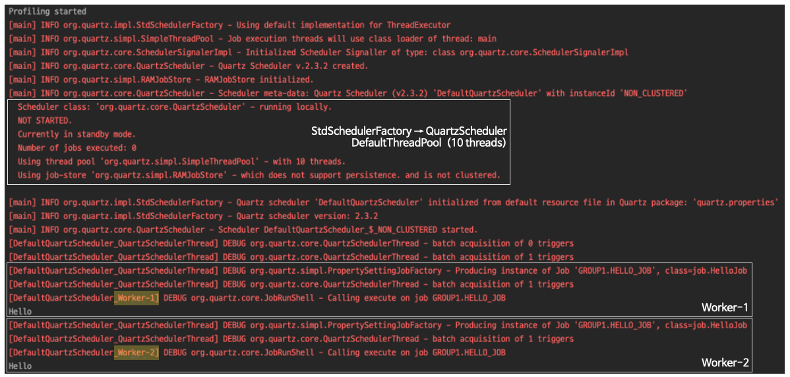
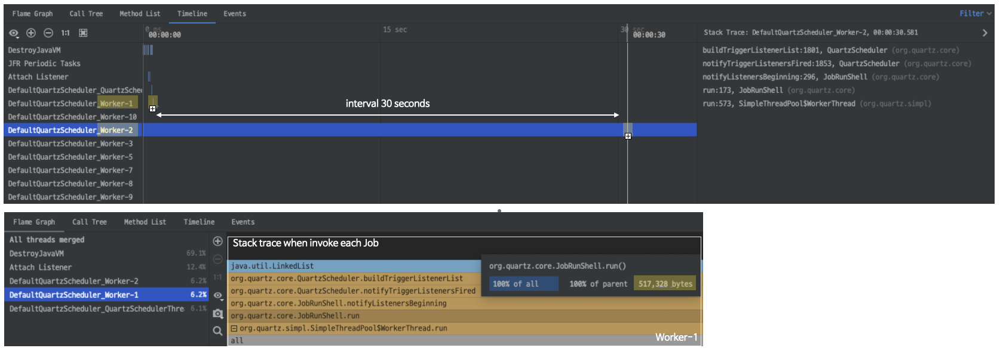

## Quartz Tutorial Lesson 1: Using Quartz

### Structure
```bash
├── build.gradle
└── src
    └── main
        └── java
            ├── Lesson1.java
            └── job
                └── HelloJob.java
```

### Captured Images

